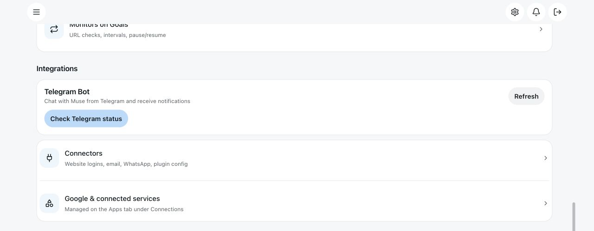

# Beli

Beli is a personal AI agent built on top of OpenMuse. It combines a native
mobile and web interface, durable server-side work, a persistent browser, an
optional Linux workspace, and a plugin system for personal integrations.

This repository is the Beli fork. Clone this repository, not the upstream
OpenMuse repository, when you want the features documented here.

[](https://github.com/CopilotKit/OpenMuse)
[](https://github.com/CopilotKit/openmuse/compare/main...onlinegill:main?expand=1)
[](#verification)
[](LICENSE)

## Install

Requirements:

- Node.js 24 LTS
- pnpm 11.19.0
- Docker only for the optional Linux computer

Clone and start the local application:

```sh
git clone https://github.com/onlinegill/beli.git
cd beli
pnpm install --frozen-lockfile
cp .env.example .env
pnpm dev
```

In another terminal, start the web client:

```sh
pnpm dev:web
```

Open:

- Web application: http://localhost:8090
- API health check: http://localhost:8787/api/health

The sample workspace runs without a model key, Google account, Docker, or
CopilotKit Intelligence subscription.

## What Beli adds

Beli is a substantial extension of OpenMuse, not a cosmetic rename. The public
fork currently differs from upstream in more than 270 files and adds roughly
41,000 source lines.

Major additions include:

- Plugin and skill discovery, validation, routing, and configuration.
- Provider and model settings with encrypted credential storage.
- Provider fallback, local Ollama support, and model selection.
- Durable personal context, memory candidates, recall, and persona.
- Subagents with depth and parallelism limits.
- Centralized tool policy, approval tokens, and owner scoping.
- Email, Telegram, WhatsApp, browser-login, and credential connectors.
- Automations, heartbeat scheduling, and workboard workflows.
- MCP client support and voice-note transcription.
- Users, roles, sessions, password hashing, and admin protections.
- Expanded native navigation, settings, inspection, and activity surfaces.

See [UPGRADES.md](UPGRADES.md) for the detailed inventory and the
[complete comparison](https://github.com/CopilotKit/openmuse/compare/main...onlinegill:main?expand=1)
for the file-by-file diff.

## Core features

| Area | Capability |
| --- | --- |
| Chat | Native and web chat with streamed agent events, tool cards, follow-up work, and retained drafts. |
| Agent computer | Persistent browser sessions, an optional Linux workspace, files, terminal commands, and PDF transfer. |
| Tasks | Durable plans, pause/resume/stop controls, approvals, retries, and restart recovery. |
| Memory | Reviewed memory candidates, recall, personal context, and editable identity. |
| Providers | OpenAI-compatible, Anthropic, Google, DeepSeek, and local Ollama providers. |
| Connectors | Encrypted credentials, browser login, email, Telegram, and WhatsApp. |
| Automation | Heartbeat jobs, scheduled work, notifications, and a workboard. |
| Subagents | Delegated tasks, collection, cancellation, and result isolation. |
| Personalization | SOUL.md personality, shortcuts, voice notes, and background updates. |
| Safety | Tool policy, reviewed external writes, owner scoping, and secret redaction. |

## Settings and integrations



Settings brings models, connectors, Telegram, agent identity, memory, security,
automations, and service health into one place.

## Configuration

The example environment file contains commented settings. Start with the local
sample configuration, then add only the providers and connectors you use.

Common settings:

| Variable | Purpose |
| --- | --- |
| `WORKSPACE_MODE` | Use `demo` for local sample data or `live` for configured providers. |
| `AGENT_BACKEND` | Select the model-backed agent or the sample agent. |
| `MODEL` | Provider and model identifier. |
| `OPENAI_API_KEY` | API key for an OpenAI-compatible provider. |
| `OPENAI_BASE_URL` | Base URL for OpenAI-compatible or local provider APIs. |
| `OPENMUSE_ACCESS_KEY` | Access key for the dashboard in live mode. |
| `TOKEN_ENCRYPTION_KEY` | Base64-encoded 32-byte key for encrypted connector credentials. |
| `DATABASE_URL` | Optional PostgreSQL connection. PGlite is used locally when unset. |
| `BROWSER_WORKER_URL` | Browser worker endpoint. |
| `WORKER_TOKEN` | Shared browser-worker authentication token. |

Never commit `.env`, `.openmuse`, browser profiles, credentials, personal
documents, or production data.

## Browser worker

Install Chromium and start the worker:

```sh
pnpm --dir apps/worker exec playwright install chromium
pnpm dev:browser
```

Set `BROWSER_WORKER_URL` and a random `WORKER_TOKEN` in `.env`. The API and
worker must use the same token.

## Optional Linux computer

Build the isolated computer image:

```sh
docker build -t openmuse-computer:local apps/computer
```

Then enable it in `.env`:

```sh
COMPUTER_ENABLED=true
COMPUTER_IMAGE=openmuse-computer:local
```

Commands run in a non-root container with a persistent `/workspace` volume and
no host-directory mounts. See [docs/COMPUTER.md](docs/COMPUTER.md).

## Project layout

| Directory | Purpose |
| --- | --- |
| `apps/mobile` | Expo and React Native client for iOS, Android, and web. |
| `apps/server` | API, agent engine, persistence, plugins, connectors, memory, and automation. |
| `apps/worker` | Playwright browser worker and persistent profiles. |
| `apps/computer` | Optional isolated Linux computer. |
| `packages/domain` | Shared domain types and validation. |
| `packages/integrations` | Provider and integration adapters. |
| `packages/backends` | Agent backend adapters. |
| `tests` | Server, workflow, browser, connector, policy, and persistence tests. |

## Verification

The published fork was checked with:

```sh
pnpm lint
pnpm typecheck
pnpm test
pnpm build:server
pnpm build:web
```

Result:

- Lint passed.
- Typecheck passed.
- Tests: 615 passed, 0 failed.
- Server build passed.
- Web build passed.

The browser-worker Docker suite and native store builds require their platform
tools and are not part of the default local verification command.

## Development

Useful commands:

```sh
pnpm dev
pnpm dev:web
pnpm dev:browser
pnpm dev:worker
pnpm dev:whatsapp
pnpm test
pnpm test:browser
pnpm test:computer
pnpm build:server
pnpm build:web
pnpm build:ios
pnpm build:android
```

Run `pnpm lint` and `pnpm typecheck` before submitting changes. Never include
real credentials, personal email data, browser sessions, or production data in
tests, recordings, commits, or issue reports.

## Status

Beli is an alpha fork for self-hosting and continued development. Some
integrations require external accounts, provider keys, or platform tooling.
The repository includes fictional sample data for local development and
demonstrations.

The fork intentionally retains upstream OpenMuse attribution and license
notices:

- Upstream project: https://github.com/CopilotKit/OpenMuse
- Full comparison: https://github.com/CopilotKit/openmuse/compare/main...onlinegill:main?expand=1
- Upgrade inventory: [UPGRADES.md](UPGRADES.md)
- Public release: https://github.com/onlinegill/beli/releases/tag/v0.1.0-beli

Fork modifications are Copyright (c) 2026 Sukhpal Gill and are released under
the MIT License.
