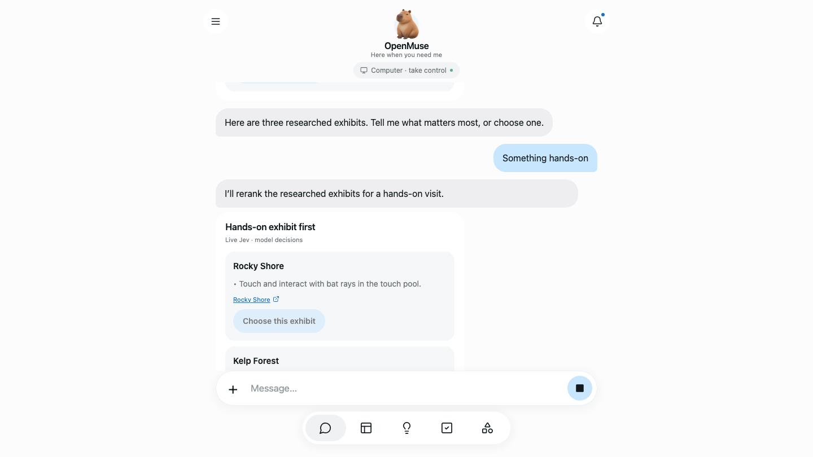

# Jev generative UI: aquarium school-trip demo

**[Watch the 83-second live Jev web recording](../../assets/demos/2026-09-23/jev-live-web.mp4)**

[](../../assets/demos/2026-09-23/jev-live-web.mp4)

The live recording calls TypeSafe Jev for each clarification and comparison decision, visibly labeled `Live Jev · model decisions` in the cards. AI Mock scripts the agent's conversation steps, while OpenMuse runs its normal mailbox, real browser worker, and `present_choices` tool. The mailbox is a fictional local Lincoln Middle School sample. The live comparison details are excerpts of the public aquarium pages read during that turn; Jev decides whether to show the agent's prepared cards and ranks those candidates. The revised hands-on preference moves Rocky Shore to first place in this recorded run.

For a repeatable, TypeSafe-key-free walkthrough, [watch the 81-second scripted sample](../../assets/demos/2026-09-23/jev-web.mp4). Its cards are labeled `Sample · scripted decisions`; it does not make a live Jev call.

## Run

From the repository root, install dependencies and configure a server-only CopilotKit Intelligence project key in the private `.env` as described in [Quick start](../../README.md#quick-start). Both sample and live modes require that key for Rich Threads. The sample needs no TypeSafe key or general model provider key.

```sh
pnpm --dir apps/worker exec playwright install chromium
pnpm dev:demo
```

The isolated launcher sets `JEV_MODE=sample`, starts AI Mock and the normal API on `127.0.0.1:8788`, and starts a real browser worker on `127.0.0.1:8791`. It forwards only the Intelligence key from the private configuration, not Google or model-provider credentials. Demo data stays under ignored `artifacts/demo/`.

To exercise **real Jev decisions** with the same scripted agent and real browser, provide a server-side `TYPESAFE_API_KEY` through your secret manager and start `DEMO_JEV_MODE=live pnpm dev:demo` instead. The launcher forwards that key only to the API process. A resulting card is labeled `Live Jev · model decisions`; live comparison excerpts are taken directly from the pages read in that turn. The scripted agent still supplies the trip scenario and candidate set, while the TypeSafe service decides whether to show the prepared cards and ranks candidates. Live Jev may choose an ordinary agent response, so the exact card sequence is not guaranteed.

In another terminal, start the app:

```sh
EXPO_PUBLIC_API_URL=http://127.0.0.1:8788 pnpm dev:web
```

Set the app's demo session token from `apps/server/src/demo/entry.ts` if the app requests one. Use the chat in a fresh task, then follow this sequence:

1. Send **Help me get ready for the aquarium trip**. The agent searches the fictional local mailbox, reads the matching thread, and shows **Complete permission slip**, **Review trip details**, and **Explore exhibits**.
2. Choose **Explore exhibits**. The real browser tool reads the aquarium's Kelp Forest, Open Sea, and Rocky Shore pages. Three sourced comparison cards appear.
3. Send **Something hands-on**. The sample scorer puts Rocky Shore first because its official page describes a bat-ray touch pool.
4. Choose **Rocky Shore**. The agent acknowledges the preference and offers to continue planning; no booking, send, or other external action occurs.
5. Reload the page and confirm the historical cards and final choice remain visible. Earlier choice controls should be disabled.

If the aquarium site or browser worker fails, the scripted agent reports the failed read and does not create a comparison card. The fixture is repeatable in its choices and copy, but public site availability and content can still change.

For a recording, show the `Sample · scripted decisions` caption, email card, clarification controls, inline browser progress, all three source links, changed hands-on ordering, and selection acknowledgement. Aim for 60–90 seconds. Verify the visible source pages still support each claim before publishing a new capture. The existing [demo recording guide](../DEMO.md#record-your-own-demo) covers web and simulator capture.

## Fixture provenance and live mode

The school, sender, recipient, message, and permission-slip document are fictional local workspace data in `apps/server/src/workspace.ts`. The candidate text in `apps/server/src/demo/jev-fixture.ts` was checked against Monterey Bay Aquarium's own pages on 2026-09-23:

| Candidate | Supported detail | Official source |
| --- | --- | --- |
| Kelp Forest | 28-foot kelp exhibit with sardines and leopard sharks | [Kelp Forest](https://www.montereybayaquarium.org/visit/exhibits/kelp-forest/) |
| Open Sea | Sea turtles, sardines, and tuna at a 90-foot viewing window | [Open Sea](https://www.montereybayaquarium.org/visit/exhibits/open-sea/) |
| Rocky Shore | Bat-ray touch pool | [Rocky Shore](https://www.montereybayaquarium.org/visit/exhibits/rocky-shore) |

For a fully live, non-scripted agent, run the ordinary API with `JEV_MODE=live`, a server-side `TYPESAFE_API_KEY`, and the required `CPK_INTELLIGENCE_API_KEY`. Configure a real model and browser worker separately. The isolated `pnpm dev:demo` command defaults to the labeled sample mode and does not forward a TypeSafe key unless `DEMO_JEV_MODE=live` is set. A sample recording must not be presented as evidence that live Jev was called.

## What live mode sends to TypeSafe

With `JEV_MODE=live`, each `present_choices` call makes one request from the API server to the TypeSafe System One endpoint, retried once after a timeout, rate limit or server error. Sample mode and `JEV_MODE=off` send nothing. The request contains:

- `userMessage`: the person's latest chat message, or the server-written continuation after they pick a choice.
- `agentSummary` and `context`: text the agent writes. It can quote email or other private workspace data the agent read during the turn.
- `selectedId`: the option already chosen, if any.
- `options`: every candidate's ID, label, details, and source titles and URLs.
- The question text and the model name, plus `TYPESAFE_API_KEY` as the bearer token.

OpenMuse does not send page text, mail threads, files, or OAuth tokens beyond what the agent put in `context` or the options. Jev returns only a choice between showing the prepared cards or answering in prose, and one fit score per option. It cannot approve, send, book, or run anything. Selections still go through OpenMuse's own checks, and external actions still require a recorded approval. On failure the server logs only the HTTP status and TypeSafe request ID, never the request body. TypeSafe's own terms apply to the data it receives; see its [data handling notes](https://docs.typesafe.ai/models#data-handling).
